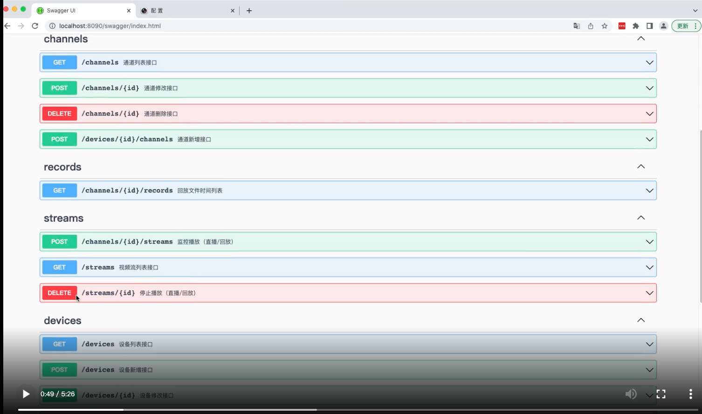

# gosip
sipserver,GB28181,ZLMediaKit

# gosip
和 [ZLMediaKit](https://github.com/xia-chu/ZLMediaKit) 一起使用，zlm配置文件中的webhook请配置为此项目的restfulapi地址，否则部分功能无法使用。
zlm免编译docker镜像 [zlm docker image](https://hub.docker.com/repository/docker/panjjo/zlmediakit)
交流方式：请加QQ群-542509000，@bzfj，或着加Q：35929310

---
## 2.0 改动说明
- 数据存储从mongo改为mysql，毕竟sql数据库用的人多，nosql比较少
- 重新整理了api接口，生成了swagger文档，可以直接在线调试
- go版本升级到1.19


---
## 快速开始
1. 运行zlmedia 具体运行方式请参考[ZLMediaKit](https://github.com/xia-chu/ZLMediaKit)
2. 启动mysql 并创建DB
3. 修改demo下的配置文件（数据库地址和zlm地址,本地端口等）
4. 启动gosip ，启动后gosip会自动创建数据库表。浏览器访问http://localhost:8090/swagger/index.html 可查看在线API文档
5. 通过设备注册接口（POST /devices) 新注册一个设备，获取到设备sipid和服务器sipid，服务器域等信息，
6. 通过通道注册接口（POST /devices/:id/channels)新增通道设备
7. 将5，6步生成的数据填充到录像机GB28181配置页面，并保存
8. 查看设备和通道是否活跃并在线
9. 通道在线后访问播放接口（POST /channels/:id/streams）获取直播流
10. 根据返回的播放地址进行播放
11. 调用关闭流接口（DELETE /streams/:id) 关闭流

### 视频教程
[](https://down-yss.oss-cn-hangzhou.aliyuncs.com/v.m4v)

---
### API接口filters使用说明
- filters的格式为 jsonencode 字符串 
``` json
    filters='[ 
        {"field_name":"userid","opertator":"=","value":"123234"},
        {"field_name":"addtime","opertator":">","value":154324556}, 
    ]' 
    // 代表的是 查询userid为123234和添加时间addtime大于154324556的用户列表
```

- 支持or查询 
``` json
     //查询用户id为123或者用户注册时间为234,姓名为345的用户的交易记录,并且交易状态为成功,交易类型为消费,查询条件为 
      filters='[ 
          {"field_name":"status","opertator":"=","value":true}, 
          {"field_name":"type","opertator":"=","value":"consume"}, 
          { 
              "or":[ 
                     [ 
                       {"field_name":"user.add","opertator":"=","value":"234"}, 
                       {"field_name":"user.name","opertator":"=","value":345} 
                     ], 
                     [ 
                       {"field_name":"userid","opertator":"=","value":"123"}, 
                     ] 
                  ] 
              } 
      ]'
 
```
- field_name 可以是返回数据中的任意字段。

## 功能支持
- [X] 设备注册管理
- [X] 实时预览
- [X] 远程回放
- [X] 录像历史文件获取
- [X] 支持流管理(Mysql存储维护），服务重启不会丢失流或者出现失控流。
- [X] 支持异步通知

## 功能描述
### 设备管理
  + 设备（/devices）
    - 设备为NVR/DVR 或者 支持28181协议的摄像头
    设备下属多个通道
    - 设备采用注册制，通过API接口注册生成设备相关参数
    - 设备新增接口会同步返回SIP服务器相关配置
  + 通道（/channels）
    - 通道为连接到NVR/DVR上的摄像头 或者 支持28181协议的摄像头
    - 通道采用注册制，通过API接口生成通道参数

### 直播/回播
+ 直播(/streams)
  - 接口返回的streamid 为国标协议中的SSRC（16进制）
  - 一个通道最多在一个直播申请，重复请求会返回同一个播放地址。
  - 接口中返回的播放地址域名是通过配置文件设置的。
  - 播放过程不能前进后退，不能暂停
  - 直播可以调用接口关闭，调用API后所有观看此通道的直播全部关闭。一般来说直播不需要手动关闭，等待无人观看5分钟后会自动关闭。（时间长度在zlm配置文件中调整）

- 回播(/streams)
  - 回放请求播放API之前，请先调用录像历史文件列表接口（/records），获取到通道可回放的时间段
  - 回放传入的时间必须在回放文件时间列表内
  - 播放过程不能前进后退，不能暂停
  - 与直播不同，回放是每次请求API都会产生一个新的流，所以要及时关闭流，比如变更播放时间后要把上一个流关闭掉，要不然就会产生很多流。回放产生的视频流也是5分钟无人观看自动关闭。（时间长度在zlm配置文件中调整）
### 录像回放文件（/records）
  - 获取时间段内的可回放文件列表，时间跨度不要太大。有些录像机是检测到移动物体才录制，这样子一天内就会有几十上百个段。建议回放时，先选择某一天，然后查询此天内可以看的时间段。
  - 录制文件过多时，系统最多等待10秒返回，10秒内能接收到多少数据算多少数据。
